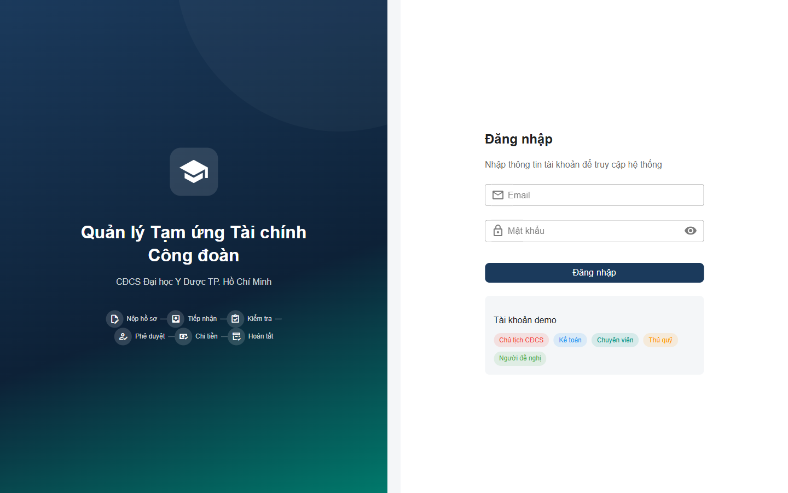
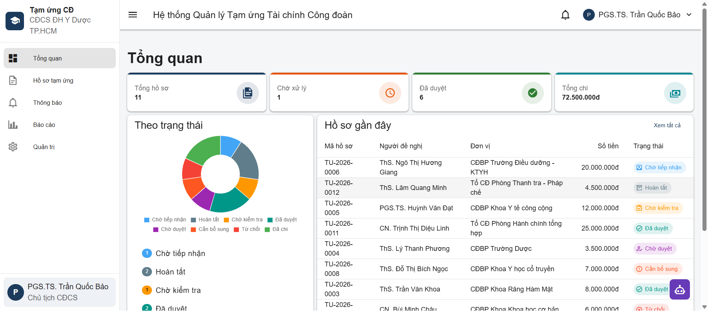
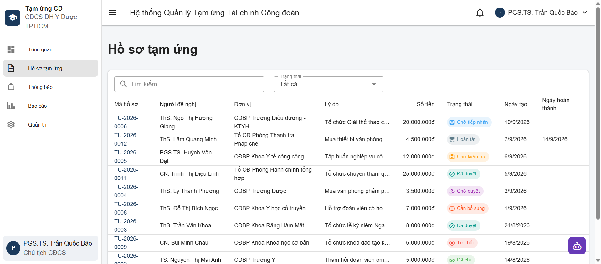
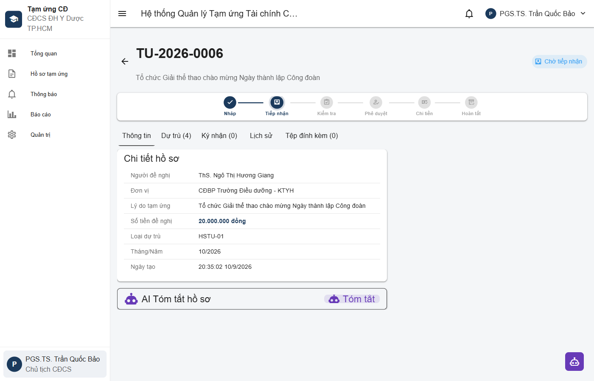
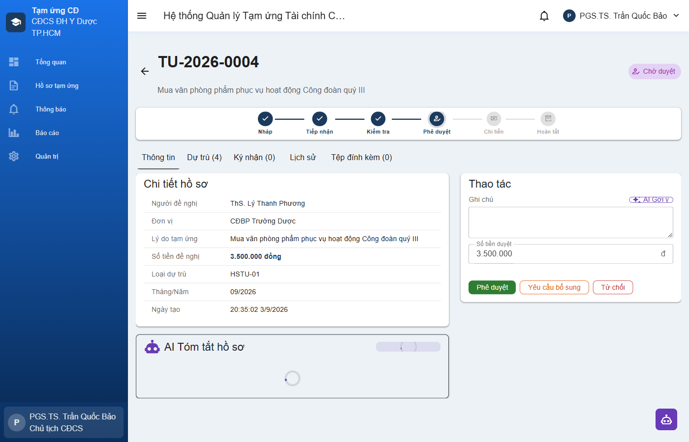
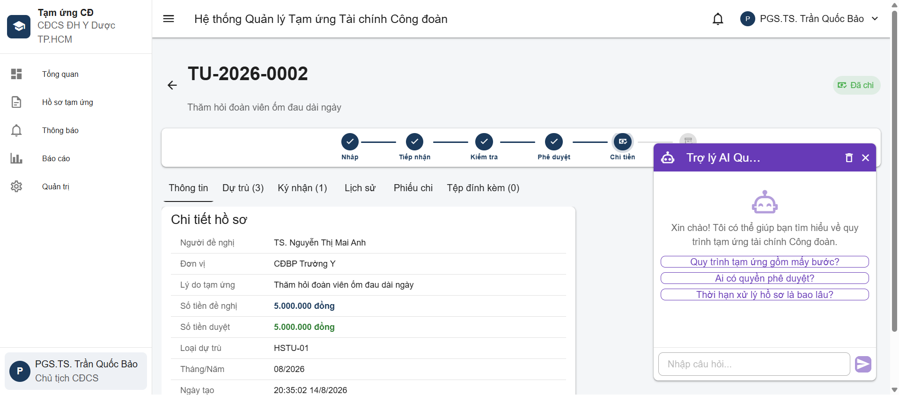
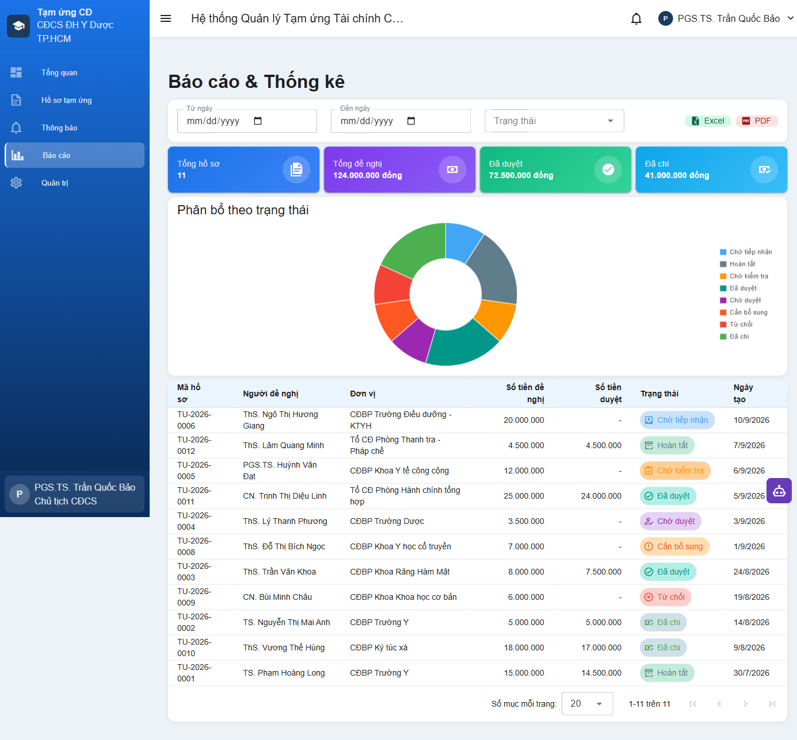
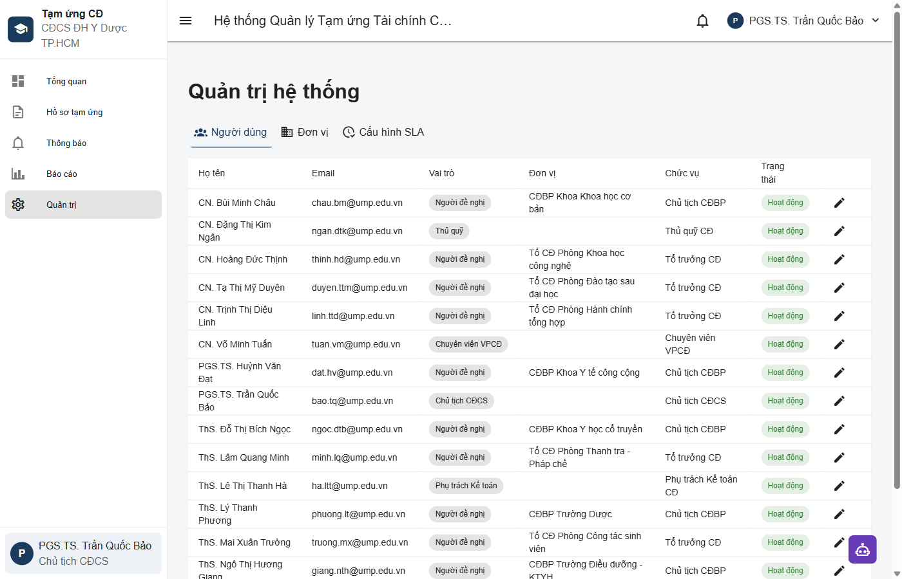

# Hệ thống Quản lý Tạm ứng Tài chính Công đoàn

**CĐCS Đại học Y Dược TP. Hồ Chí Minh**

> Sản phẩm dự thi **"Ứng dụng AI Tự động hóa Công việc tại ĐH Y Dược TP.HCM"**

**Live Demo:** [https://web-production-404e7.up.railway.app](https://web-production-404e7.up.railway.app)

---

## Demo

| Màn hình | Ảnh chụp |
|----------|----------|
| Đăng nhập |  |
| Tổng quan (Chủ tịch) |  |
| Danh sách hồ sơ |  |
| Chi tiết hồ sơ + Workflow |  |
| AI Tóm tắt & Kiểm tra |  |
| AI Chatbot |  |
| Báo cáo & Biểu đồ |  |
| Quản trị hệ thống |  |

---

## Tổng quan

Hệ thống số hóa toàn bộ quy trình tạm ứng tài chính công đoàn — từ lúc đoàn viên tạo hồ sơ đề nghị cho đến khi hoàn tất chi tiền và lưu trữ. Thay thế quy trình giấy tờ thủ công bằng luồng xử lý trực tuyến có phân quyền, theo dõi trạng thái, và hỗ trợ AI.

### Quy trình 6 bước

```
Tạo hồ sơ → Tiếp nhận → Kiểm tra → Phê duyệt → Chi tiền → Lưu trữ
(Đoàn viên)  (Chuyên viên) (Kế toán)  (Chủ tịch)  (Thủ quỹ)  (Chuyên viên)
```

### 5 vai trò người dùng

| Vai trò | Chức năng chính |
|---------|----------------|
| **Người đề nghị** | Tạo, theo dõi hồ sơ tạm ứng |
| **Chuyên viên VPCĐ** | Tiếp nhận, kiểm tra đầu vào, lưu trữ |
| **Kế toán CĐ** | Kiểm tra hợp lệ, xác nhận chi, báo cáo |
| **Chủ tịch CĐCS** | Phê duyệt / từ chối, quản trị hệ thống |
| **Thủ quỹ CĐ** | Xác nhận chi tiền, lập phiếu chi C41-BB |

---

## Cơ cấu tổ chức Công đoàn

### 9 Công đoàn Bộ phận (CĐBP)

| Mã | Tên đơn vị |
|----|-----------|
| CDBP-01 | CĐBP Trường Y |
| CDBP-02 | CĐBP Khoa Răng Hàm Mặt |
| CDBP-03 | CĐBP Trường Dược |
| CDBP-04 | CĐBP Khoa Y tế công cộng |
| CDBP-05 | CĐBP Trường Điều dưỡng - KTYH |
| CDBP-06 | CĐBP Bệnh viện ĐHYD TPHCM |
| CDBP-07 | CĐBP Khoa Y học cổ truyền |
| CDBP-08 | CĐBP Khoa Khoa học cơ bản |
| CDBP-09 | CĐBP Ký túc xá |

### 17 Tổ Công đoàn (Tổ CĐ)

| Mã | Tên đơn vị |
|----|-----------|
| TCD-01 | Tổ CĐ Phòng Hành chính tổng hợp |
| TCD-02 | Tổ CĐ Phòng Thanh tra - Pháp chế |
| TCD-03 | Tổ CĐ Phòng Đào tạo đại học |
| TCD-04 | Tổ CĐ Phòng Khoa học công nghệ |
| TCD-05 | Tổ CĐ Phòng Công tác sinh viên |
| TCD-06 | Tổ CĐ Phòng Đào tạo sau đại học |
| TCD-07 | Tổ CĐ Phòng Đảm bảo chất lượng giáo dục và Khảo thí |
| TCD-08 | Tổ CĐ Phòng Hợp tác quốc tế |
| TCD-09 | Tổ CĐ Phòng Tổ chức cán bộ |
| TCD-10 | Tổ CĐ Phòng Kế hoạch tài chính |
| TCD-11 | Tổ CĐ Phòng Quản trị giáo tài |
| TCD-12 | Tổ CĐ Trung tâm Công nghệ thông tin |
| TCD-13 | Tổ CĐ Trung tâm Y sinh học phân tử |
| TCD-14 | Tổ CĐ Trung tâm Kiểm chuẩn chất lượng xét nghiệm y học |
| TCD-15 | Tổ CĐ Trung tâm Giáo dục Y học - Phẫu thuật thực nghiệm |
| TCD-16 | Tổ CĐ Thư viện - Tạp chí y học |
| TCD-17 | Tổ CĐ Trung tâm Đào tạo nhân lực y tế theo nhu cầu xã hội |

---

## Chức năng AI (Google Gemini)

Hệ thống tích hợp 4 chức năng AI, tất cả đều có **kiểm soát con người** — kết quả AI chỉ mang tính tham khảo, người dùng luôn xem xét và chỉnh sửa trước khi sử dụng.

| # | Chức năng | Mô tả |
|---|-----------|-------|
| 1 | **AI Tóm tắt** | Tóm tắt nội dung hồ sơ: lý do, dự trù, trạng thái, lịch sử xử lý |
| 2 | **AI Kiểm tra** | Phân tích hồ sơ, phát hiện bất thường, đánh giá tính hợp lệ |
| 3 | **AI Gợi ý nhận xét** | Dự thảo nhận xét phê duyệt/từ chối phù hợp ngữ cảnh |
| 4 | **AI Chatbot** | Tra cứu quy trình, quy định, thời hạn xử lý qua hội thoại |

---

## Công nghệ

### Backend
- **Runtime:** Node.js + Express.js
- **Database:** PostgreSQL 17 (PL/pgSQL triggers, generated columns, custom enums)
- **Auth:** JWT + bcryptjs
- **AI:** Google Gemini API (`@google/generative-ai`)
- **Security:** Helmet, CORS, role-based middleware

### Frontend
- **Framework:** Vue 3 (Composition API, `<script setup>`)
- **UI:** Vuetify 4 (Material Design 3)
- **Build:** Vite 8
- **State:** Pinia
- **Charts:** Chart.js + vue-chartjs
- **Export:** xlsx + file-saver (Excel), jsPDF + jspdf-autotable (PDF, hỗ trợ tiếng Việt)

### Infrastructure
- **Local:** Docker Compose (PostgreSQL + API)
- **Cloud:** Railway (PostgreSQL + Web service)
- **DB Init:** Tự động tạo schema + dữ liệu mẫu 12 hồ sơ khi khởi động

---

## Cài đặt & Chạy

### Yêu cầu
- [Docker Desktop](https://www.docker.com/products/docker-desktop/) (bao gồm Docker Compose)
- [Node.js](https://nodejs.org/) >= 18
- [Google Gemini API Key](https://aistudio.google.com/apikey) (cho chức năng AI)

### Bước 1: Clone & cấu hình

```bash
git clone https://github.com/huynhanhdao1234/ump-quy-trinh-tam-ung.git
cd ump-quy-trinh-tam-ung
```

Tạo file `.env` ở thư mục gốc:

```env
GEMINI_API_KEY=your-google-gemini-api-key
```

### Bước 2: Khởi động Backend (Docker)

```bash
docker compose up -d
```

Lệnh này sẽ:
- Khởi tạo PostgreSQL 17 với schema + dữ liệu mẫu
- Chạy API server trên cổng `3000`

Kiểm tra: `docker compose ps` — cả 2 service `postgres` và `api` đều ở trạng thái `running`.

### Bước 3: Khởi động Frontend

```bash
cd client
npm install
npm run dev
```

Truy cập: **http://localhost:5173**

### Triển khai lên Railway (Cloud)

1. Fork repo này trên GitHub
2. Tạo tài khoản [Railway](https://railway.app) (đăng ký bằng GitHub)
3. Tạo project mới → **Add PostgreSQL** database
4. **Add Service** → chọn GitHub repo → Railway sẽ tự build bằng `Dockerfile`
5. Thêm biến môi trường cho web service:
   - `DATABASE_URL` → `${{Postgres.DATABASE_URL}}` (reference variable)
   - `JWT_SECRET` → một chuỗi bí mật bất kỳ
   - `GEMINI_API_KEY` → API key từ Google AI Studio
   - `PORT` → `3000`
6. **Generate Domain** → nhận URL public
7. Database sẽ tự khởi tạo schema + dữ liệu mẫu khi service khởi động lần đầu

### Tài khoản demo

| Vai trò | Email | Mật khẩu |
|---------|-------|-----------|
| Chủ tịch CĐCS | `bao.tq@ump.edu.vn` | `ct123456` |
| Kế toán CĐ | `ha.ltt@ump.edu.vn` | `kt123456` |
| Chuyên viên VPCĐ | `tuan.vm@ump.edu.vn` | `cv123456` |
| Thủ quỹ CĐ | `ngan.dtk@ump.edu.vn` | `tq123456` |
| Người đề nghị | `long.ph@ump.edu.vn` | `ky123456` |

> Các tài khoản người đề nghị khác: mật khẩu chung `123456`

---

## Cấu trúc dự án

```
quy-trinh-tam-ung/
├── client/                  # Vue 3 + Vuetify frontend
│   ├── src/
│   │   ├── api/             # HTTP client & API modules
│   │   ├── components/      # UI components (AI cards, charts, chips...)
│   │   ├── plugins/         # Vuetify config
│   │   ├── router/          # Vue Router
│   │   ├── stores/          # Pinia stores (auth, notifications)
│   │   ├── utils/           # Constants, export helpers, money format
│   │   └── views/           # Page components
│   └── vite.config.js
├── server/                  # Express.js API
│   ├── middleware/           # JWT auth middleware
│   ├── routes/              # REST API routes (13 modules)
│   ├── app.js               # Entry point
│   ├── db.js                # PostgreSQL connection pool
│   └── Dockerfile
├── db/
│   └── init.sql             # Schema + triggers + sample data
├── docs/                    # Tài liệu tiếng Việt
│   ├── screenshots/         # Ảnh chụp màn hình thật
│   ├── quy-trinh-tam-ung.md
│   ├── huong-dan-su-dung.md
│   └── huong-dan-trien-khai.md
├── docker-compose.yml
└── .env.example
```

---

## Tính năng nổi bật

- **Workflow trực quan** — Thanh tiến trình 6 bước hiển thị vị trí hồ sơ trong quy trình
- **Thông báo realtime** — Database triggers tự động tạo thông báo khi hồ sơ chuyển trạng thái
- **Xuất báo cáo** — Excel (.xlsx) và PDF (hỗ trợ đầy đủ tiếng Việt có dấu)
- **Biểu đồ thống kê** — Dashboard và báo cáo với biểu đồ Doughnut phân bổ trạng thái
- **Responsive** — Giao diện tương thích desktop và mobile
- **Phân quyền nghiêm ngặt** — 5 vai trò, mỗi vai trò chỉ thấy menu và thao tác phù hợp
- **Quản lý đơn vị** — 9 CĐBP + 17 Tổ CĐ, hiển thị đơn vị trên hồ sơ và tài khoản người dùng
- **Dữ liệu mẫu** — 12 hồ sơ ở 9 trạng thái khác nhau, sẵn sàng demo
- **SLA cấu hình** — Chủ tịch có thể điều chỉnh thời hạn xử lý từng bước

---

## API Endpoints

| Nhóm | Prefix | Mô tả |
|------|--------|-------|
| Auth | `/api/auth` | Đăng nhập, kiểm tra session |
| Requests | `/api/requests` | CRUD hồ sơ tạm ứng |
| Workflow | `/api/workflow` | Chuyển trạng thái hồ sơ |
| Estimates | `/api/requests/:id/estimates` | Bảng dự trù kinh phí |
| Sign List | `/api/requests/:id/signlist` | Danh sách ký nhận |
| History | `/api/requests/:id/history` | Lịch sử xử lý |
| Payments | `/api/requests/:id/payment` | Phiếu chi C41-BB |
| Files | `/api/requests/:id/files` | Upload/download đính kèm |
| Users | `/api/users` | Quản lý người dùng |
| Units | `/api/units` | Quản lý đơn vị |
| Notifications | `/api/notifications` | Thông báo |
| Config | `/api/config` | Cấu hình SLA |
| AI | `/api/ai` | 4 endpoints AI (Gemini) |

---

## Tài liệu

| Tài liệu | File |
|-----------|------|
| Sơ đồ quy trình | [`docs/quy-trinh-tam-ung.md`](docs/quy-trinh-tam-ung.md) |
| Hướng dẫn sử dụng | [`docs/huong-dan-su-dung.md`](docs/huong-dan-su-dung.md) |
| Hướng dẫn triển khai | [`docs/huong-dan-trien-khai.md`](docs/huong-dan-trien-khai.md) |

---

## License

Dự án phục vụ cuộc thi nội bộ tại Đại học Y Dược TP. Hồ Chí Minh.
