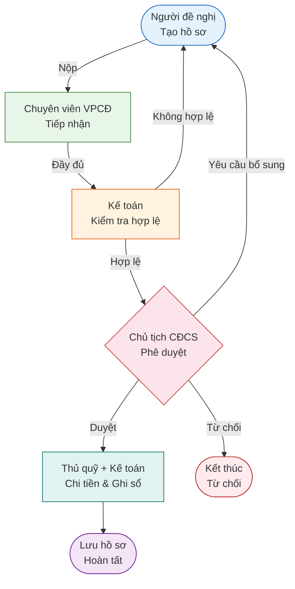

# Quy trình Tạm ứng Tài chính Công đoàn Cơ sở

**CĐCS Đại học Y Dược TP. Hồ Chí Minh**

---

## 1. Mục đích

Quy trình này quy định các bước đề nghị, xét duyệt và chi tạm ứng tài chính phục vụ hoạt động Công đoàn tại CĐCS Đại học Y Dược TP. Hồ Chí Minh, nhằm:

- Đảm bảo minh bạch, đúng quy chế trong quản lý tài chính Công đoàn.
- Rút ngắn thời gian xử lý hồ sơ, tránh thất thoát và sai sót.
- Phân rõ trách nhiệm từng khâu xử lý.

## 2. Phạm vi áp dụng

Áp dụng cho tất cả **Công đoàn Bộ phận (CĐBP)** và **Tổ Công đoàn (Tổ CĐ)** trực thuộc CĐCS Đại học Y Dược TP.HCM, bao gồm:

- 9 CĐBP (Trường Y, Khoa RHM, Trường Dược, Khoa YTCC, Trường ĐD-KTYH, BV ĐHYD TPHCM, Khoa YHCT, Khoa KHCB, KTX)
- 17 Tổ CĐ (các Phòng/Trung tâm/Thư viện)

## 3. Sơ đồ quy trình

## 4. Chi tiết các bước

### Bước 1: Nộp hồ sơ

| Mục | Nội dung |
|-----|----------|
| **Người thực hiện** | Người đề nghị (đại diện CĐBP/Tổ CĐ) |
| **Thao tác** | Tạo hồ sơ mới trên hệ thống: điền lý do tạm ứng, tháng/năm, lập bảng dự trù kinh phí (HSTU-01), danh sách ký nhận, đính kèm chứng từ liên quan |
| **Đầu vào** | Thông tin đề nghị, bảng dự trù chi tiết |
| **Đầu ra** | Hồ sơ ở trạng thái **Chờ tiếp nhận** |

### Bước 2: Tiếp nhận hồ sơ

| Mục | Nội dung |
|-----|----------|
| **Người thực hiện** | Chuyên viên Văn phòng Công đoàn |
| **Thao tác** | Kiểm tra hồ sơ đầy đủ thông tin và chứng từ. Nếu đủ → chuyển Kế toán. Nếu thiếu → yêu cầu bổ sung |
| **SLA** | Tối đa **1 ngày** làm việc |
| **Đầu ra** | Hồ sơ ở trạng thái **Chờ kiểm tra** |

### Bước 3: Kiểm tra hợp lệ

| Mục | Nội dung |
|-----|----------|
| **Người thực hiện** | Kế toán Công đoàn |
| **Thao tác** | Kiểm tra tính hợp lệ chứng từ, đối chiếu số liệu dự trù, xác nhận ngân sách. Nếu hợp lệ → chuyển Chủ tịch. Nếu không → yêu cầu bổ sung |
| **SLA** | Tối đa **3 ngày** làm việc |
| **Đầu ra** | Hồ sơ ở trạng thái **Chờ duyệt** |

### Bước 4: Phê duyệt

| Mục | Nội dung |
|-----|----------|
| **Người thực hiện** | Chủ tịch CĐCS |
| **Thao tác** | Xem xét hồ sơ và quyết định: (a) **Phê duyệt** — xác nhận số tiền duyệt, (b) **Yêu cầu bổ sung** — ghi rõ nội dung cần bổ sung, (c) **Từ chối** — ghi rõ lý do |
| **SLA** | Tối đa **1 ngày** làm việc |
| **Đầu ra** | Hồ sơ ở trạng thái **Đã duyệt**, **Cần bổ sung** hoặc **Từ chối** |

### Bước 5: Chi tiền

| Mục | Nội dung |
|-----|----------|
| **Người thực hiện** | Thủ quỹ (chi tiền) + Kế toán (ghi sổ) |
| **Thao tác** | Thủ quỹ lập phiếu chi C41-BB, chi tiền (tiền mặt hoặc chuyển khoản). Kế toán ghi sổ kế toán |
| **SLA** | Tối đa **3 ngày** làm việc |
| **Đầu ra** | Hồ sơ ở trạng thái **Đã chi**, phiếu chi C41-BB được tạo |

### Bước 6: Hoàn tất

| Mục | Nội dung |
|-----|----------|
| **Người thực hiện** | Kế toán + Chuyên viên VPCĐ |
| **Thao tác** | Đối chiếu chứng từ, lưu trữ hồ sơ |
| **SLA** | Tối đa **3 ngày** làm việc |
| **Đầu ra** | Hồ sơ ở trạng thái **Hoàn tất** |

## 5. Vai trò và trách nhiệm

| Vai trò | Trách nhiệm chính | Trạng thái xử lý |
|---------|-------------------|-------------------|
| **Người đề nghị** | Lập hồ sơ đề nghị tạm ứng, bổ sung khi được yêu cầu | Nháp, Cần bổ sung |
| **Chuyên viên VPCĐ** | Tiếp nhận hồ sơ, kiểm tra đầy đủ, lưu trữ | Chờ tiếp nhận, Đã chi |
| **Kế toán CĐ** | Kiểm tra hợp lệ, ghi sổ, xác nhận chi | Chờ kiểm tra, Đã duyệt, Đã chi |
| **Thủ quỹ CĐ** | Chi tiền, lập phiếu chi | Đã duyệt |
| **Chủ tịch CĐCS** | Phê duyệt, từ chối, yêu cầu bổ sung | Chờ duyệt |

## 6. Biểu mẫu

| Mã biểu mẫu | Tên biểu mẫu | Mô tả |
|-------------|---------------|-------|
| **HSTU-01** | Bảng dự trù kinh phí | Chi tiết các hạng mục chi, đơn giá, số lượng, thành tiền |
| **C41-BB** | Phiếu chi | Phiếu chi tiền mặt/chuyển khoản theo mẫu kế toán công đoàn |

## 7. Thỏa thuận mức dịch vụ (SLA)

| Bước xử lý | Người thực hiện | Thời hạn tối đa |
|------------|-----------------|-----------------|
| Tiếp nhận hồ sơ | Chuyên viên VPCĐ | 1 ngày làm việc |
| Kiểm tra hợp lệ | Kế toán CĐ | 3 ngày làm việc |
| Phê duyệt | Chủ tịch CĐCS | 1 ngày làm việc |
| Chi tạm ứng | Thủ quỹ + Kế toán | 3 ngày làm việc |
| Lưu hồ sơ | Kế toán + Chuyên viên | 3 ngày làm việc |
| **Tổng thời gian tối đa** | | **11 ngày làm việc** |

## 8. Trạng thái hồ sơ

| Trạng thái | Mã hệ thống | Ý nghĩa |
|-----------|-------------|---------|
| Nháp | `nhap` | Hồ sơ đang soạn, chưa nộp |
| Chờ tiếp nhận | `cho_tiep_nhan` | Đã nộp, chờ chuyên viên kiểm tra |
| Chờ kiểm tra | `cho_kiem_tra` | Chuyên viên đã nhận, chờ kế toán |
| Cần bổ sung | `can_bo_sung` | Bị trả lại, cần bổ sung thông tin |
| Chờ duyệt | `cho_duyet` | Kế toán đã xác nhận, chờ Chủ tịch |
| Đã duyệt | `da_duyet` | Chủ tịch đã phê duyệt, chờ chi |
| Từ chối | `tu_choi` | Chủ tịch từ chối, kết thúc |
| Đã chi | `da_chi` | Đã chi tiền cho người đề nghị |
| Hoàn tất | `hoan_tat` | Đã lưu trữ, quy trình kết thúc |
